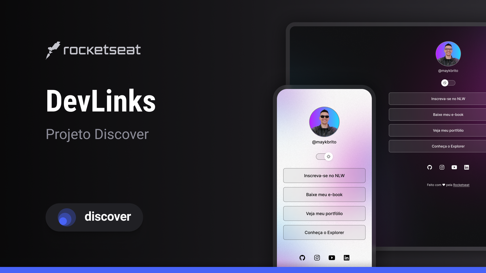

<h1 align="center"> WM-Barberclub </h1>

Programa exclusivo e gratuito, promovido pela rocketseat para ensino de tecnologias web

 <a href="#-tecnologias"> Tecnolgias </a> &nbsp;&nbsp;&nbsp;&nbsp;&nbsp;&nbsp;
 <a href="#-projeto">projeto</a>&nbsp;&nbsp;&nbsp;&nbsp;&nbsp;&nbsp;
 <a href="#-layout">Layout</a>&nbsp;&nbsp;&nbsp;&nbsp;&nbsp;&nbsp;
 <a href="#memo-licença">Licença</a>

  
  

 

 

## Tecnologias

Esse projeto foi desenvolvido com as seguintes tecnologias :
- HTML e CSS
- JavaScript
- Git e Github
- Figma

## Projeto

O Devlinks é um agragador de links para usar como cartão de visitas online.

## Layout

Você pode visualizar o Layout do projeto através [DOLINK]

(https://www.figma.com/file/J1Z33MISC22YZB8wfxiIns/NLW-Copa-Explorer/duplicate). É necessário ter conta no [FIGMA]
(https://figma.com) Para acessá-lo.

## Licença

Esse projeto está sob a licença MIT.

Feito com <3 by Rocketseat [Participe da nossa comunidade!]
(https://discord.gg/rocketseat)